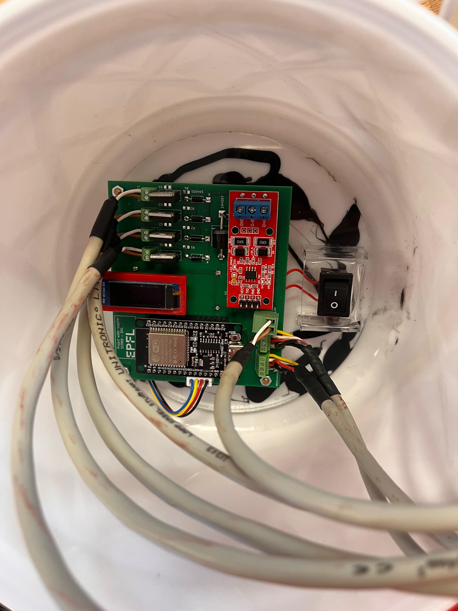

# Garden Automation — ESP32



Automated garden watering system based on ESP32, soil moisture sensors (RS485/Modbus), solenoid valves, and MQTT over WiFi.

Youtube link: [ https://youtube.com/shorts/rQiWS8xde-I?feature=share ](https://youtu.be/8DQGsPcLfHw)

KiCad files are available in the folder /kicad

---

## Hardware

| Component | Details |
|-----------|---------|
| MCU | ESP32-WROOM-32D |
| Moisture sensors | RS485 Modbus (x2), addresses 0x01 and 0x02 |
| Solenoid valves | 3× EV (EV1, EV2, EV3) driven via GPIO |
| Pump | 1× driven via GPIO |
| Display | SSD1306 OLED 128×32, I2C |
| Communication | WiFi SoftAP + MQTT |

### Pin Mapping

| Pin | Function |
|-----|----------|
| GPIO 23 | Pump |
| GPIO 19 | EV1 |
| GPIO 22 | EV2 |
| GPIO 3 | EV3 |
| GPIO 32 | OLED SDA |
| GPIO 33 | OLED SCL |
| GPIO 16 | RS485 RX |
| GPIO 17 | RS485 TX |

---

## Software

### Dependencies

All libraries are loaded from `/Users/rascarcapac/Documents/Arduino/libraries` via `lib_extra_dirs` in `platformio.ini`.

| Library | Purpose |
|---------|---------|
| Adafruit SSD1306 | OLED display |
| Adafruit GFX | Graphics primitives |
| PubSubClient | MQTT client |
| RTClib | DS3231 RTC (optional, not used in this branch) |

### platformio.ini

```ini
[env:esp32dev]
platform = espressif32
board = esp32dev
framework = arduino

monitor_speed = 115200
monitor_echo = yes
monitor_filters = send_on_enter

lib_extra_dirs = /Users/rascarcapac/Documents/Arduino/libraries
```

---

## Architecture

### Serial communication

Two separate modes are used depending on context:

- **Wizard (setup)** — character-by-character read loop with `yield()` to feed the FreeRTOS watchdog. Blocking by design since it waits for human input.
- **Runtime (loop)** — non-blocking char-by-char buffer. A complete command is processed only when `\n` is received.

### Runtime commands (Serial or MQTT)

Format: `CMD` or `CMD:value`

| Command | Effect |
|---------|--------|
| `WATER:1` | Start watering cycle on EV1 |
| `WATER:2` | Start watering cycle on EV2 |
| `WATER:3` | Start watering cycle on EV3 |
| `STOP` | Stop active watering cycle immediately |
| `STATUS` | Print current state to Serial |
| `RESET_DAILY` | Reset daily water usage counter |

The same `processRuntimeCommand()` function handles both Serial and MQTT input.

### MQTT topics

| Topic | Direction | Content |
|-------|-----------|---------|
| `garden/valve/command` | subscribe | `WATER:1`, `STOP`, etc. |
| `garden/sensors/sensor1/humidity` | publish | float, e.g. `42.3` |
| `garden/sensors/sensor1/temperature` | publish | float |
| `garden/sensors/sensor2/humidity` | publish | float |
| `garden/sensors/sensor2/temperature` | publish | float |
| `garden/pump/state` | publish | `ON` or `OFF` |

### WiFi

The ESP32 runs as a **SoftAP** (access point), not a station. Other devices connect to it.

| Parameter | Value |
|-----------|-------|
| SSID | `Colloc` |
| IP | `192.168.4.1` |
| MQTT broker expected at | `192.168.4.2` |

---

## Watering logic

- Watering triggers when a sensor reads below **30% humidity**
- Each valve has a **cooldown period** of 2 minutes between cycles
- A **daily water budget** is computed from reservoir size (10 L) divided by configured number of days
- Usage is persisted in NVS (flash) and survives reboots
- Maximum single cycle duration: 30 seconds

---

## Configuration wizard

On first boot (or if NVS is not calibrated), a serial wizard guides through:

1. Sensor calibration (dry / wet reference values)
2. Plumbing check
3. Sensor → valve mapping
4. Watering days configuration
5. Hardware test (each valve + pump for 5s)

Type `r` at any prompt to restart the wizard from the beginning.
